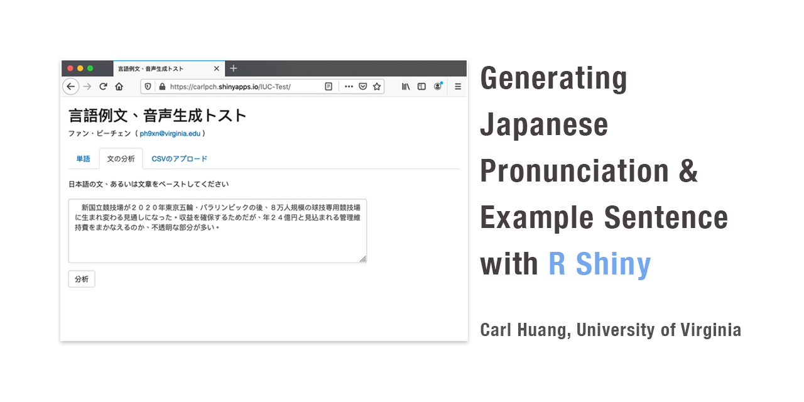

# App Description 
Simple web app for Japanese language learners (still at testing stage)
A simple web app that help download load Japanese word pronunciation (from Forvo.com) and example sentence from yourei.jp. 

# Oct 2020 Note to Users
Due to the temporary breakdown of Forvo API (https://api.forvo.com/status/), part of this app is currently not functioning. I am in touch with Forvo to resolve this issue and will find alternatives when necessary.
